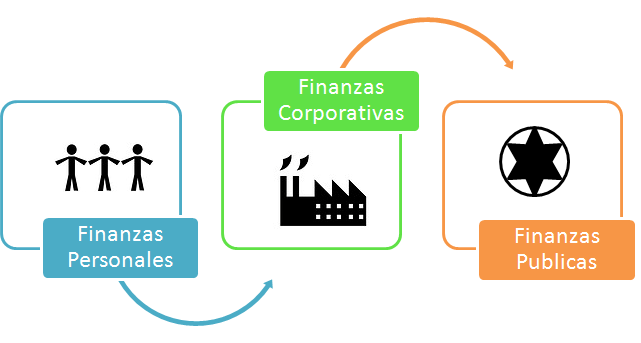

# Finanzas

Las finanzas son una rama de la economía que describe ampliamente el estudio y el sistema del dinero, las inversiones y otros instrumentos financieros, como los mercados, las instituciones que operan en ellos, las políticas de captación de recursos, el valor del dinero en el tiempo, entre otros; así como la obtención y administración de los recursos económicos. 

Las finanzas ayudan a controlar los ingresos y egresos tanto de las personas, empresas y gobiernos; por tanto existen 3 tipos de finanzas. 

## Finanzas Personales 

Las finazas personales constan de la gestión de los recursos económicos y financieros, contemplando todas las acciones de ahorro y gasto razonable del dinero por parte de un individuo y los eventos que podrían afectar de manera negativa sus recursos monetarios; por eso la planificación a diferentes plazos es escencial en este ámbito.

Un manejo inteligente de las finanzas personales abre las puertas a la inclusión financiera, crecimiento económico personal,  mejora de la calidad de vida y, en términos globales, al desarrollo de un país.

Objetivos más comúnes :

- **Estabilidad ante imprevistos:** tener finanzas personales sólidas te otorga la estabilidad suficiente para que tu nivel de vida no se vea afectado cuando algún evento golpeé la economía, bien sea una situación personal inesperada o problemas económicos en el país donde vives.

- **Libertad financiera:** un plan de finanzas personales bien administradas, que incluya hacer inversiones en diferentes instrumentos, te llevará al punto de la independencia financiera.

- **Jubilación:** si manejas tu dinero con inteligencia, contarás con un ingreso extra a la hora de retirarte del campo laboral y podrás mantener tu estilo de vida.

- **Inversión:** a través de las inversiones logras que tu dinero genere rendimientos y de esa forma evitas que la inflación se coma tus ahorros.

## Finanzas Públicas

Comprende los bienes, rentas y deudas que forman el activo y el pasivo de la Nación y todos los demás bienes y rentas cuya administración corresponde al Poder Nacional a través de las distintas instituciones creadas por el estado para tal fin. 

El Estado para poder realizar sus funciones y afrontar sus necesidades públicas, debe contar con recursos, y los mismos se obtienen a través de los diferentes procedimientos legalmente estatuidos.

El estado hace uso de los recursos necesarios provenientes de su gestión política para desarrollar actividades financieras a través de la explotación y distribución de las riquezas para satisfacer las necesidades públicas (individuales y colectivas).

Los objetivos de las finanzas públicas son garantizar un mayor control social sobre su gestión, mejorar los medios e instrumentos que hoy existen de representación política y social y establecer otras vías de participación complementarias a las de representación política, que fortalezcan, descentralicen su poder y transfieran responsabilidades y recursos a las comunidades estatales y locales.

## Finanzas Empresariales 

Son aquellas que se centran en las decisiones monetarias o de inversión que toman las empresas, para la identificación de oportunidades de inversión y análisis de viabilidad económica. El objetivo fundamental de las finanzas empresariales es maximizar el valor de la empresa para sus accionistas.