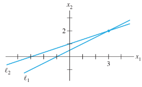
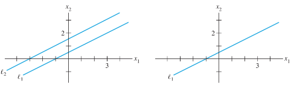
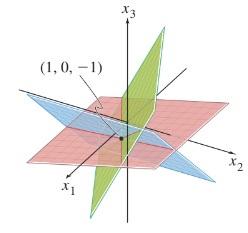

# Systems of Linear Equations
A linear equation in the variables $x_1, x_2$, . . ., $x_n$ is an equation that can be written in the
form $a_1x_1, a_2x_2, . . ., a_nx_n = b$

where $b$ and the **coefficients** $a_1, a_2, . . ., a_n$ an are real or complex numbers, the subscript $n$ may be any positive integer. In real-life problems, n might be 50 or 5000, or even larger. The equations 

$$4x_1 - 5x_2 + 2 = x_1 \hspace{4mm}and\hspace{4mm} x_2 = 2(\sqrt{6} - x_1) + x_3$$

Because they can be rearranged algebraically as:

$$3x_1-5_x2 = -2 \hspace{4mm}and\hspace{4mm} 2x_1 + x_2 - x_3 = 2 \sqrt{6}$$

The equations 

$$4x_1 - 5x_2 = x_1x_2 \hspace{4mm}and\hspace{4mm} x_2 = 2\sqrt{x_1} - 6$$

are not linear because of the presence of $x_1x_2$ in the first equation and $\sqrt{x1}$ in the second. A system of linear equations (or a linear system) is a collection of one or more linear equations involving the same variables.

$$2x_1 - x_2 + 1.5x_3 = 8\\ 
x_1 \hspace{10 mm} - 4x_3 = -7$$

A solution of the system is a list $(s1, s2,...,sn)$ of numbers that makes each equation a true statement when the values $(s1, s2,...,sn)$ are substituted for $(x1, x2,...,xn)$, respectively.

The **set** of **all possible solutions** is called the **solution set** of the linear system. Two linear systems are called **equivalent if they have the same solution set.**

## Two Variables

Finding the solution set of a system of two linear equations in two variables is easy because it amounts to **finding the intersection of two lines**. Example: 
$$x_1 - 2x_2 = -1\\ 
-x_1 + 3x_2 = 3$$

The graphs of these equations are lines, which we denote by $l_1$ and $l_2$. A pair of numbers $(x_1, x2_)$ satisfies both equations in the system if and only if the point $(x_1, x2_)$ lies on both $l_1$ and $l_2$. In the system above, the solution is the single point (3, 2).

two lines need not intersect in a single point—they could be parallel, or they could coincide and hence “intersect” at every point on the line.

For the graph 1, we dont have a solution, and for the graph 2, we have infinitely solutions. Thereforea system of linear equations has:

- No solution
- Exactly one solution
- Infinitely many solutions

A system is said to be **inconsistent** if has no solution and a system is **consistent** if it has either 1 solution or infinitely solutions.

If we are workin with 3 variables, we are looking a point that lies in the planes i.e.

## Matrix Notation

The essential information of a linear system can be recorded compactly in a rectangular array called a matrix.

$$x_1-2x_2+x_3 = 0 \\
\hspace{10mm}2x_2-8x_3=8\\
\hspace{2mm}5x_1\hspace{10mm}-5x_3=10$$

**Coefficient Matrix:** the coefficients of each variable aligned in columns

$$\begin{equation}
\begin{bmatrix}
1 & -2 & 1\\
0 & 2 & -8\\
5 & 0 & -5
\end{bmatrix}
\end{equation}$$

**Augmented Matrix:** coefficient matrix with an added column containing the constants from the right sides of the equation.

$$\begin{equation}
\begin{bmatrix}
1 & -2 & 1 & 0\\
0 & 2 & -8 & 8\\
5 & 0 & -5 & 10
\end{bmatrix}
\end{equation}$$

## Solving a Linear System

The basic strategy is to replace one system with an equivalent system (one with the same solution set) that is easier to solve. Three elementary rows operations are used to simplify a linear system. 

- **(Replacement)** Replace one row by the sum of itself and a multiple of another row
- **(Interchange)** Interchange two rows.
- **(Scaling)** Multiply all entries in a row by a nonzero constant.

**Example**

$$\begin{equation}
\begin{bmatrix}
1 & -2 & 1 & 0\\
0 & 2 & -8 & 8\\
5 & 0 & -5 & 10
\end{bmatrix}
\end{equation}$$

Keep $x_1$ in the first equation and eliminate it from de other equations.

$-5 · [equation 1]\\
+[equation 3]\\
\overline{[new\hspace{2mm}equation3]}$

Now in order to obtain 1 as the coefficient for $x_2$, multiply equation 2 by 1/2.

$[new\hspace{2mm}equation2] = 1/2 · [equation 2]$

With the 2 previous operations we obtain:

$$\begin{equation}
\begin{bmatrix}
1 & -2 & 1 & 0\\
0 & 1 & -4 & 4\\
0 & 10 & -10 & 10
\end{bmatrix}
\end{equation}$$

Use $x_2$ in equation 2 to eliminate the $10x_2$ in equation 3.

$-10 · [equation 2]\\
+[equation 3]\\
\overline{[new\hspace{2mm}equation3]}$

The result of this calculation:
$$\begin{equation}
\begin{bmatrix}
1 & -2 & 1 & 0\\
0 & 1 & -4 & 4\\
0 & 0 & 30 & -30
\end{bmatrix}
\end{equation}$$

Multiply equation 3 by 1/30 to obtain 1 as the coefficient for $x_3$:
$$\begin{equation}
\begin{bmatrix}
1 & -2 & 1 & 0\\
0 & 1 & -4 & 4\\
0 & 0 & 1 & -1
\end{bmatrix}
\end{equation}$$

Use $x_3$ in equation 3 to eliminate the $-4x_3$ and $x_3$ in equations 1 and 2.

$-1 · [equation 3]\\
+[equation 1]\\
\overline{[new\hspace{2mm}equation1]}$

$4 · [equation 3]\\
+[equation 2]\\
\overline{[new\hspace{2mm}equation2]}$

Obtaining:

$$\begin{equation}
\begin{bmatrix}
1 & -2 & 0 & 1\\
0 & 1 & 0 & 0\\
0 & 0 & 1 & -1
\end{bmatrix}
\end{equation}$$

Finally move back to equation 2 and use it to eliminate the $-2x_2$ above it, since there is now no arithmetic involving $x_3$ terms.

$2 · [equation 2]\\
+[equation 1]\\
\overline{[new\hspace{2mm}equation1]}$

Obatining the final result:

$$\begin{equation}
\begin{bmatrix}
1 & 0 & 0 & 1\\
0 & 1 & 0 & 0\\
0 & 0 & 1 & -1
\end{bmatrix}
\end{equation}$$

$$x_1 = 1\\
x_2 = 0\\
x_3 = -1$$

It is important to note that row **operations are reversible**. 

Any solution of the original system remains a solution of the new system. Conversely, since the original system can be produced via row operations on the new system, each solution of the new system is also a solution of the original system.

## Existence and Uniqueness