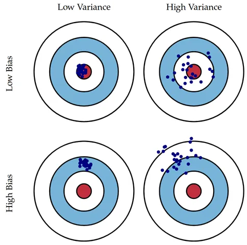
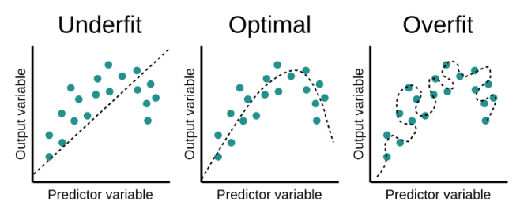

# Metrics to Evaluate Machine Learning Algorithms

Evaluating our machine learning model is an essential step to know if we can apply this model to the whole dataset. If we apply the model to all the data before evaluating it, we may have erroneous results, as the model may be unbalanced, which would lead to overfitting or underfitting, making our results very poor. Before explaining the evaluation metrics, we'll see what underfit and overfit is.

## Underfit and Overfit

The error produced from the training set is known as Bias and the error by testing set is Variance.

In Underfit, the best fit line doesn’t cover many data points present. Thus, in the training dataset itself, there is a high chance of occurrence of error (high bias). And eventually in the testing dataset also (high variance).

In an overfit line, the best fit line covers every single data points, this may be well and good in the case of training dataset (low bias). But, when a testing dataset is provided to the same model, there will be a high error in the testing dataset (high variance).

But only a Good fit line, the best fit line will be in such a way that any point to be predicted will be accurately predicted. Consequently, it will still have a low bias and low variance.

To avoid underfit and overfit we must have enough instances for generalization and several to ensure that the model performs well. Few instances will lead us to an underfit and too many to an overfit.

Once we know why we have to evaluate our model, we'll continue with some validation methods.

## Validation Methods

Before we apply the metrics to the model to see its performance we have to apply validation methods.Some of the most famous methods are:

- K Fold Cross Validation
- Leave One Out Cross Validation LOOCV
- Boostrap Sampling 

Finally after knowing the **validation methods** we are free to apply the validation metrics

## Metrics

The model may give satisfying results when evaluated using a metric say **accuracy_score** but may give **poor results** when evaluated **against other metrics** such as logarithmic_loss or any other such metric. That is why it's important to know the metrics and when to use them.

## Supervised Learning

### Accuracy

- Presicion
- Recall
- F-Measure
- Confusion Matrix

## Unsupervised Learning
- Internal Validation
- External Validation

