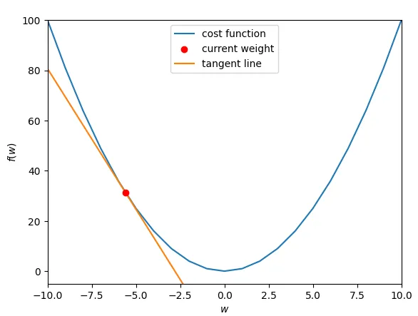
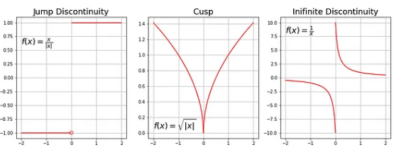
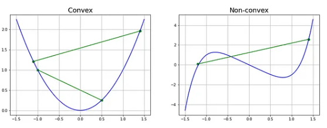
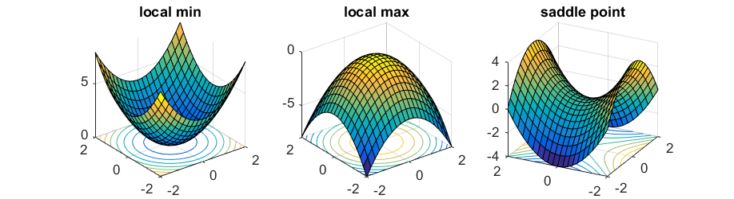
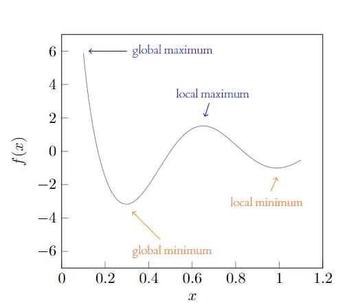
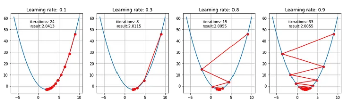
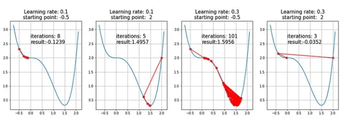

# 'Mathematical' Gradient

The gradient is a vector representing the rate of change of a scalar function with respect to its independent variables at a given point.

If we have a escalar function $\Huge f(x_1, x_2, ..., x_n)$, the gradient of $f$ denoted as $\Huge\nabla f$, is a vector that contains all the partial derivatives of $f$ with respect to each of its idependent variables.

$$\huge\nabla f = \begin{bmatrix}
\frac{\partial f}{\partial x_1} \\ \\ 
\frac{\partial f}{\partial x_2} \\ \\
... \\ \\ 
\frac{\partial f}{\partial x_n}
\end{bmatrix}$$

### Example

Let’s assume we are interested in a gradient at point p(10,10):

$$\Huge f(x)=0.5x^{2} + y ^{2}$$

$$\huge\nabla f(x,y) = \begin{bmatrix}
\frac{\partial f(x,y)}{\partial x}=x \\ \\ 
\frac{\partial f(x,y)}{\partial y}=2y
\end{bmatrix}$$

$$\huge\nabla f(10,10) = \begin{bmatrix}
10 \\ 
20
\end{bmatrix}$$

By looking at these values we conclude that the slope is twice steeper along the y axis.

# Gradient Descent 

Gradient descent (GD) is an iterative first-order optimisation algorithm, used to find a local minimum/maximum of a given function. This method is commonly used in machine learning (ML) and deep learning (DL) to minimise a cost/loss function. Gradient descent can be applied to almost any cost function.

The idea behind gradient descent is that the derivative of each weight will reveal its direction and influence on the cost function. In the image below, the cost function is f(w) = w², which is a parabola. The minimum is at (0,0), and the current weight is -5.6. The current loss is 31.36, and the line in orange represents the derivative, or current rate of change for the weight, which is -11.2. This indicates the weight needs to move “downhill” — or become more positive — to reach a loss of 0. This is where gradient descent comes in.

Intuitively it is a slope of a curve at a given point in a specified direction.

In the image above the slope is negative, so when we substract this value in the GD algorithm this will we positive and we will move a positive direction in the x axis, approaching the minimun in each iteration; when we have a positive slope the opposite happens.

In the case of a univariate function, it is simply the first derivative at a selected point. In the case of a multivariate function, it is a vector of derivatives in each main direction (along variable axes). Because we are interested only in a slope along one axis and we don’t care about others these derivatives are called partial derivatives.

## Requirements 

Gradient descent algorithm does not work for all functions. There are two specific requirements. A function has to be:

- Differentiable
- Convex

First, what does it mean it has to be differentiable? If a function is differentiable it has a derivative for each point in its domain; not all functions meet these criteria. Examples of non differentiable functions:

Second, we have to check if the function is convex. For a univariate function, this means that the line segment connecting two function’s points lays on or above its curve (it does not cross it). If it does it means that it has a local minimum which is not a global one.

Another way to check mathematically if a univariate function is convex is to calculate the second derivative and check if its value is always bigger than 0.

$\Huge\frac{d^{2}f(x)}{dx^{2}}>0$

It is also possible to use quasi-convex functions with a gradient descent algorithm. However, often they have so-called saddle points (called also minimax points) where the algorithm can get stuck. For multivariate functions the most appropriate check if a point is a saddle point is to calculate a Hessian matrix.

## Gradient Descent Algorithm 

Gradient Descent Algorithm iteratively calculates the next point using gradient at the current position, scales it (by a learning rate) and subtracts obtained value from the current position (makes a step). It subtracts the value because we want to minimise the function (to maximise it would be adding). This process can be written as:

$\Huge w_{i+1} = w_i - \alpha\nabla (f(w_i))$

- $w_i\leadsto$ Vector of parameters in the $i$ iteration
- $\alpha\leadsto$ Learning Rate. Control the step size at each iteration
- $\alpha\nabla (f(w_i))\leadsto$ Gradient of the funcion evaluated at each iteration.

By negating the scaled gradient, we go in the opposite direction, the new weight becomes more positive, and the slope of the new gradient is less steep. As the slope becomes more positive, each iteration yields a smaller update.

This process is repeated until a stopping condition is met, which may be a fixed number of iterations, a tolerance on convergence, or any other problem-specific condition.

The **learning rate** is very important and have a strong influence on performance. 

- The smaller learning rate the longer GD converges, or may reach maximum iteration before reaching the optimum point.
- If learning rate is too big the algorithm may not converge to the optimal point (jump around) or even to diverge completely.

### Steps

- Choose a starting point (initialisation)
- Calculate gradient at this point
- Make a scaled step in the opposite direction to the gradient (if the objective is minimise)
- Repeat points 2 and 3 until one of the criteria is met

### Example 1 - Quadratic Function

$\Huge f(x)=x^2-4x+1$

$\Huge \frac{\partial f(x)}{\partial x} = 2x -4$

**Gradient Descendent**

$\Huge x_i=x_{i-1}-\alpha(2x-4)$

### Example2 - Saddle Point

$\Huge f(x)=x^4-2x^3+2$

An existence of a saddle point imposes a real challenge for the first-order gradient descent algorithms like GD, and obtaining a global minimum is not guaranteed. Second-order algorithms deal with these situations better (e.g. Newton-Raphson method).

## Challenges of Gradient Descent

- **Choosing the Right Learning Rate:** Picking an appropriate learning rate (α) is crucial. Too small, and the algorithm will converge very slowly. Too large, and it might overshoot the optimal point or even diverge.

- **Convergence to Local Minima:** Gradient descent can get stuck in local minima, especially in complex, non-convex loss landscapes. It might miss the global minimum and settle for a suboptimal solution.

- **Sensitivity to Initial Parameters:** The starting values of m and b can influence convergence. Starting far from the optimal values might lead to slow convergence or convergence to a suboptimal solution.

- **Overfitting or Underfitting Data:** Gradient descent might lead to overfitting if the model becomes too complex or underfitting if it's too simple, impacting the predictive power of the model.