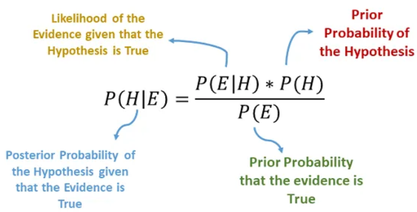

# Naive Bayes

Naive Bayes is a classification technique that is based on Bayes’ Theorem with an assumption that all the features that predicts the target value are independent of each other. It calculates the probability of each class and then pick the one with the highest probability. Bayes’ Theorem describes the probability of an event, based on a prior knowledge of conditions that might be related to that event.

**What makes Naive Bayes a “Naive” algorithm?**

Naive Bayes classifier assumes that the features we use to predict the target are independent and do not affect each other. While in real-life data, features depend on each other in determining the target, but this is ignored by the Naive Bayes classifier.