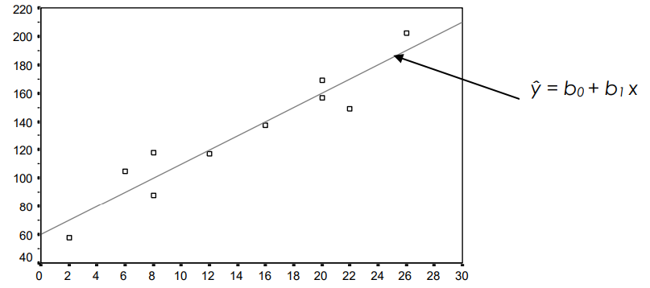
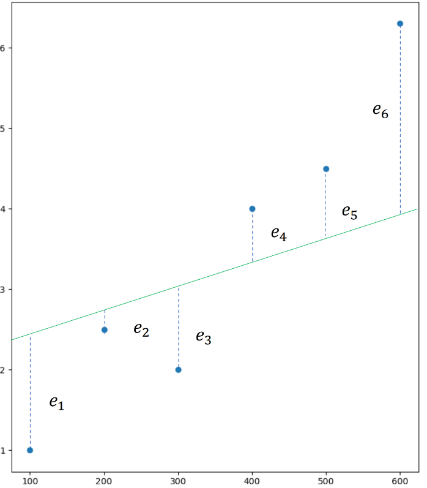

# Regression

In practice we often need to solve problems involving correlation between variables; so in supervised learning we have a dataset *X* and from them we try to predict the values for the *Y* data set. The goal is to create a model that learn from the X data and relate them with the Y data.

The relationship between the *X* data and the *Y* values can be determined by means of a function $h(x)$ were the values to be predicted can be discrete or continous. 

Although prediction is not deterministic, since there may be many other unknown variables that affect the outcome, but we can make a good prediction.

## Estimated forecast

$$\Huge\hat{y} = b_0 + b_1x$$

$b_0 \leadsto$ intersection 

$b_1 \leadsto$ pending

$x \leadsto$ independent variable

$\hat{y}\leadsto$ estimated value of *y* for a specific value of *x*

## Estimated Error
Each regression line we choose to model the data will have an associated sum of the error with respect to the estimated regression line, where each error is bascially the residual.

$$\Huge\varepsilon=\sum_{i=1}^{n}|y_i-\hat{y_i}|$$

## Loss Function
Sum of squares of the error with respect to the estimated regression line.
SCE = Square Coefficient Error

$$\Huge SCE(b_0, b_1)=\sum_{i=1}^{n}e_i^{2}=\sum_{i=1}^{n}(y_i-\hat{y_i})^{2}$$

### Optimization Problem

To get the minimun error we have to optimized the Square Coefficient Error by finding a formula to obtain the best $b_0$ and $b_1$. For this we can perform the following partial derivatives.

$\Huge\frac{\partial SCE(b_0,b_1)}{\partial b_0}=\frac{\partial\sum(y_i-\hat{y_i})^{2}}{\partial b_0}=\frac{\partial\sum_(y_i-b_0-b_1x_i)^{2}}{\partial b_0}=0$

$\Huge\frac{\partial SCE(b_0,b_1)}{\partial b_1}=\frac{\partial\sum(y_i-\hat{y_i})^{2}}{\partial b_1}=\frac{\partial\sum(y_i-b_0-b_1x_i)^{2}}{\partial b_1}=0$

## Ordinary Least Squares

The ordinary least squares method consists of finding the $b_0$ and $b_1$ values that minimize the sum of the squares of the deviations between the observed values of the dependent variable $y_i$ and the estimated values of the same $\^{y_i}$. In other words, we minimize the sum of the residuals or the error.

Solving the partial drivatives of the optimization problem we can find the  $b_0$ and $b_1$ values that minimize the sum. So by solving them we obtain:

$\Huge b_0=\frac{\sum y_i - \sum b_1x_i}{n}=\={y}-b_1\={x}$

$\Huge b_0=\frac{n\sum x_iy_i - \sum x_i \sum y_i}{n\sum x_i^{2}-(\sum x_i)^{2}}$

### Disadvantages from OLS
- With this method there is no learning, no learning from mistakes.
- The independet variables should be correlated with the dependent variable, but no with each other.
- The computational cost increases considerably when applied to a data set with many variables

$\Huge \hat{y} = b_0 + b_1x_1 + ... + b_nx_n$ 
$\Huge \Downarrow$ 
- Requires solve n+1 derivatives 
- Solve a system of n+1 equations 
- Make m summations
