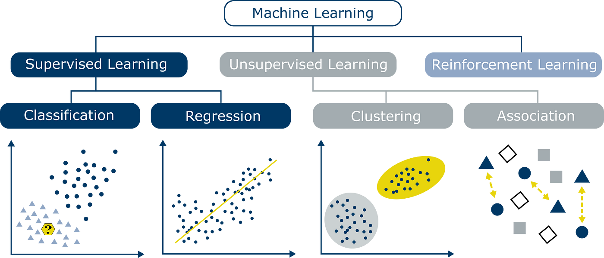

# Machine Learning Models

## Introduction To Learning
Term coined in 1959 by Arthur Samuel en the context of solving the checkers game through a Machine.

The **program** or the machine **can deduce information on its own and appy it in another time**. A program can learn to produce a behaviour for which it wasn't programmed and from which the programer can't be concious.

**Machine Learning** is a subtask of the Artificial Intelligence which is responsible of the induction of a model through a learning process.

Supervised Learning (Predictive) |Unsupervised Learning (Descriptive)|Reinforcement Learning
---                              |---                                |---
Regression                       |Association                        |Model Free
Classification                   |Clustering                         |Model Based

## Supervised Learning 
Supervised Learning input is provided as a labelled dataset, a model can learn from it to provide the result of the problem easily.

### Classification problems
This algorithm helps to predict a discrete value. It can be thought, the input data as a member of a particular class or group. For instance, taking up the photos of the fruit dataset, each photo has been labelled as a mango, an apple, etc. Here, the algorithm has to classify the new images into any of these categories.

- **Naive Bayes Classifier**
- **Support Vector Machines**
- **Logistic Regression**

### Regression problems
These problems are used for continuous data. For example, predicting the price of a piece of land in a city, given the area, location, number of rooms, etc. And then the input is sent to the machine for calculating the price of the land according to previous examples. Examples-

- **Linear Regression**
- **Nonlinear Regression**
- **Bayesian Linear Regression**

## Unsupervised Learning

This learning algorithm is completely opposite to Supervised Learning. In short, there is no complete and clean labelled dataset in unsupervised learning. Unsupervised learning is self-organized learning. Its main aim is to explore the underlying patterns and predicts the output.  Here we basically provide the machine with data and ask to look for hidden features and cluster the data in a way that makes sense.

- **K – Means clustering**
- **Neural Networks**
- **Principal Component Analysis**

## Reinforcement Learning

It is neither based on supervised learning nor unsupervised learning. Moreover, here the algorithms learn to react to an environment on their own. It is rapidly growing and moreover producing a variety of learning algorithms. These algorithms are useful in the field of Robotics, Gaming etc.

For a learning agent, there is always a start state and an end state. However, to reach the end state, there might be a different path. In Reinforcement Learning Problem an agent tries to manipulate the environment. The agent travels from one state to another. The agent gets the reward(appreciation) on success but will not receive any reward or appreciation on failure. In this way, the agent learns from the environment.

|               |**Supervised**                 |**Unsupervised ML**                           	   |**Reinforcement ML**
|---            |---                            |---                                               |---
|**Definition**	|Learns by using labelled data	|Trained using unlabelled data without any guidance|	Works on interacting with the environment
|**Type of data**|Labelled data	                |Unlabelled data	                               |No – predefined data
|**Type of problems**|Regression and classification|Association and Clustering|	Exploitation or Exploration
|**Algorithms**|Linear Regression, Logistic Regression, SVM, KNN...|K – Means, C – Means, Apriori...|Q – Learning, SARSA...
|**Aim**|Calculate outcomes|Discover underlying patterns|Learn a series of action
|**Application**|Risk Evaluation, Forecast Sales|Recommendation System, Anomaly Detection|Self Driving Cars, Gaming, Healthcare