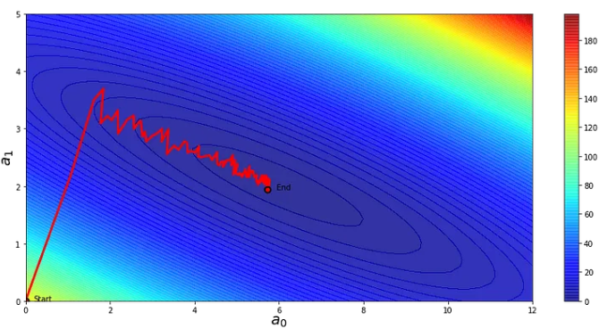

# Variants of Gradient Descent

In [Gradient Descent](GradientDescent.md) we saw what it is, how it works, requirements, problems, among other things. Now we'll take a look in the variants of this algorithm and what is each one for.

## Batch Gradient Descent (BGD)

This type uses the **entire dataset** to compute the gradient of the loss function. It's straightforward but **can be slow for large datasets**. It's suitable for well-behaved, convex optimization problems.

$$\Huge w' = w - \alpha \sum_{i=1}^{n}\nabla f_i (w)$$

### Pros:

- A simple algorithm that just needs to compute a gradient
- A fixed learning rate can be used during training and BGD can be expected to converge
- Very quick convergence ratio to a global minimum if the loss function is convex (and to local minimum one for non-convex functions)

### Cons:

- Even with a vectorised implementation, it may be slow when datasets are huge (case of Big Data)
- Not all problems are convex so gradient descent algorithms are not universal

### Typical use cases:

- Small databases that fit into computer memory 
- Problems with convex cost functions (like OLS, Logistic Regression, etc.)

## Stochastic Gradient Descent (SGD)

Here, we randomly pick one data point at a time to compute the gradient. The idea is **not to use the entire dataset** to calculate the gradient but **only a single sample.** Since the objective is to speed up the process, it's **faster** but can be more **erratic** in finding the minimum. In contrary to Batch GD **it doesn’t converge directly** to the solution, since the steps are quite noisy. However, it is much more efficient less CPU/GPU load. This effect is barely visible for small databases but has a huge impact on performance when dealing with big data. It's also useful when dealing with non-convex problems.

There are two main rules in terms of selecting a sample:

- **Randomised rule:** randomly chosen sample (repetitions possible)
- **Cyclic rule:** each sample once or minimised number of repetitions.

$$\Huge w' = w - \alpha \nabla f_i (w)$$

### Pros:

- Converges quicker (less time) than Batch GD for huge datasets
- Can escape from local minima

### Cons:

- Steps are noisier( may require more iterations to converge with limits).
- It can “bounce around” global optimum (fluctuating cost).
- It's less precise than BGD but can still find good solutions.

### Typical use case:

- Is a basis of more advanced stochastic algorithms used in training artificial neural networks
- Large dataset and want faster updates.  

## Mini-Batch Gradient Descent (m-BGD)

This is a combination of BGD and SGD, offering a good **balance between precision and speed**. The idea is to use a subset of observations to update the gradient. It **uses a batch of data** (usually between 10 and 1,000) to compute the gradient. It's faster than BGD and less erratic than SGD. Mini-batch GD is a good compromise when you have a moderately sized dataset

$$\Huge w' = w - \alpha \sum_{i=1}^{s}\nabla f_i (w)$$

### Pros:

- A good balance between BGD and SGD in terms of efficiency
- Easily fits into computer memory
- Can escape from local minimums

### Cons:

- It can still “bounce around” global optimum, it may require bigger tolerance than Batch GD but smaller than SGD
- One more hyper-parameter to optimize (batch size).

### Typical use case:

- It is very common algorithm in training of deep neutral networks.
- When the dataset is moderately sized.