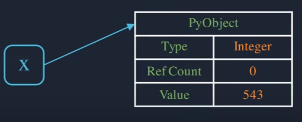
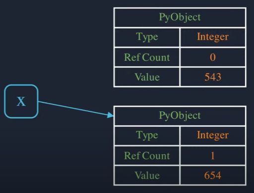
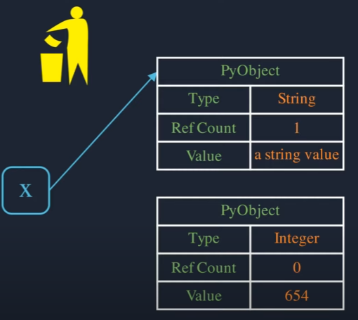
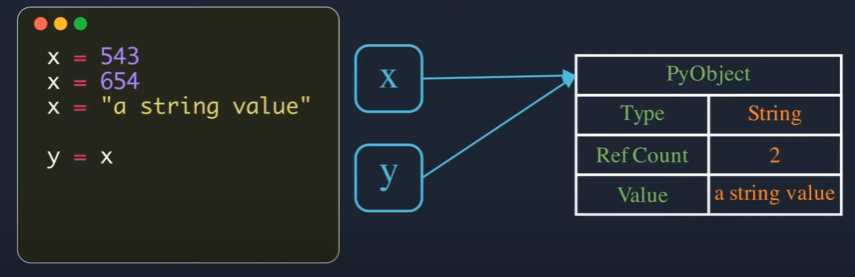
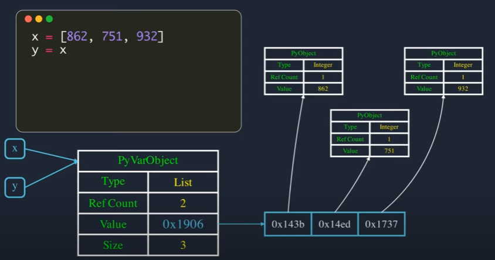
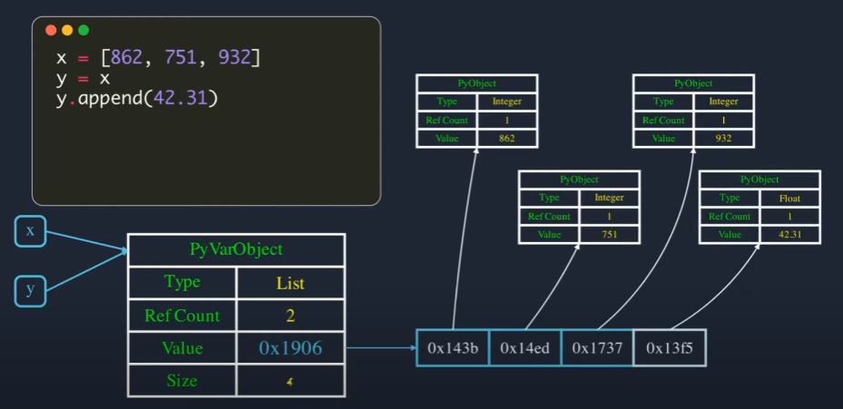
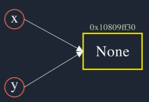
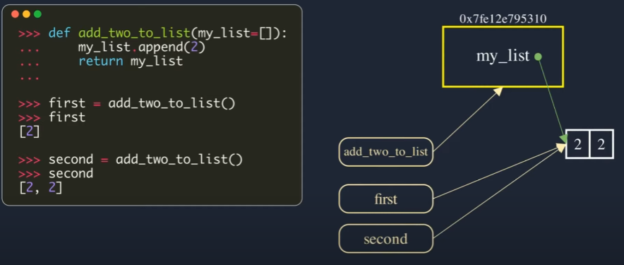
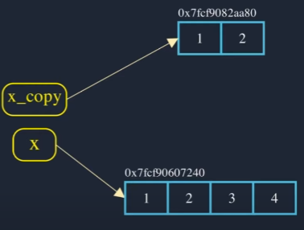
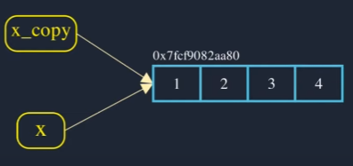

# Variables

When we create a variable in python, we dont have to specify the type of data, that is because **everything is an object in Python**, when we **assign some value** to a variable a **new object** is created in the **Heap Memory**.

The PyObject represents the base structure for all Python Objects, which is constructed in C as a structure; this structure has 3 mainly properties: 

- Type
- Reference Count
- Value

Once created, these objects do not move around in memory and when we assign a value to a variable, we are actually referencing the variable to the object which contains the value.

## Primitive data

First we must see how Python works with primitive data, such as strings or integers, with the following example:

```Python
x=543
```



$x$ now is pointing to the object which contains the value of 543 and it's reference count becomes 1.

```Python
x=543
x=654
```

When a new value is assigned to the variable $x$ a new object is created at a different memory adress and the reference is updated to point to the new object. So the new object's refrence count becomes 1 and that of old becomes 0.



Python memory manager periodically cleans such objects with zero reference counts. This process is called garbage collection.

Python is said to be a dynamically typed language, becase the variable is not associated with the type of information, so we can reuse the same variable name to reference different types such as strings, lists integers, etc...

```Python
x=543
x=654
x="a string value"
```


When a new variable is created by assigning existing value, Python does not create a new object, instead the new variable will reference to the same object of the variable we assign.

```Python
x=543
x=654
x="a string value"
y=x
```



All the primitive data suchs as integers or strings are inmutable data, that means we can't change it, so when we have 2 variables pointing to a vlues and we modify it, Python will create another object. 

## Conatiner Data Types

The bascis structure for containers type objects is PyVarObject, which is just a PyObject with an additional *size* field, that is used to store the numer of elements that the container object holds. The *value* field will be a pointer to the memory location of the stoerage array where actual elements are stored; so the element is not directly stored in this array, instead only pointers to the elements.



When a new object is append to the container, a new object is created in memory and a pointer to it is appended to the backing array, and the value size is incremented. 



When we modify the container by $x$ and then we print the value by $y$, we will see the changes, beacuse we modify the object and both $x$ and $y$ are pointing to that object. So we have to be carefull with this operations. This obviusly will only happen to mutable objetcs, because inmutable can not be change.

```python
a=[1,2,3]
b=a
b=[4,5,6]
```
If we make this, we won't change $a$, instead we will make $b$ to point another object; remember we only change the object by 'internal' operations like append or changing the values of the elements directly.

## None 

In Python it only exits a None object, so when we assing None to 1 or some variable, all bill be pointing to the same address and not many none objects will be created. This is called interning or re-using objects.

```Python
x=None
y=None
```



## Pass by Value and Reference to Fucntions 

Remember everything is an object in Python, even functions. Function is an object of the function class and the function object is created at some memory adress.



So everything we pass as a parameter will by pass by reference, but remember there are some inmutuable values, that we can't change, as primitive data or the same immutable objects, so when we pass these type of data won't change.

So when we pass a primitive data to a function, this will be pass as a copy, because it is inmutable. If we wnat to pass an object, but we don't want to change it in the function, we can pass a copy of it, i.e.

```python
def append2(l):
    l.append(2)

myList=[1,3,4,5]
myList2=[1,3,4,5]

append2(myList)
#myList = [1,3,4,5,2]

append2(mylist2.copy())
# myList2 = [1,3,4,5]
```

## Augmented arithmetic assignment operators

If we make a explicit operation between two objects, Python will create another object with the result.

```python
x=[1,2]
x_copy=x

x = x + [3,4]
```


But if we use the augmented arithmetic assignment operators, Pyhton will change the object in which we are making the operation.

```python
x=[1,2]
x_copy=x

x += [3,4]
```
 